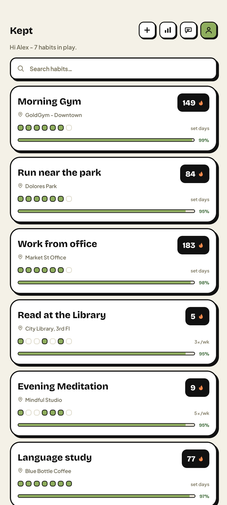
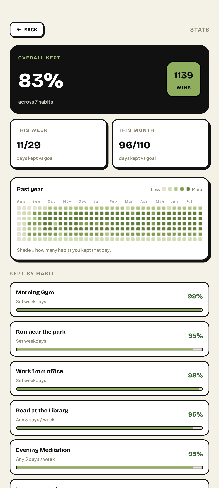
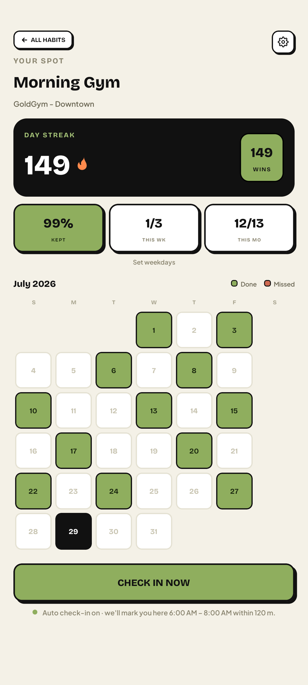
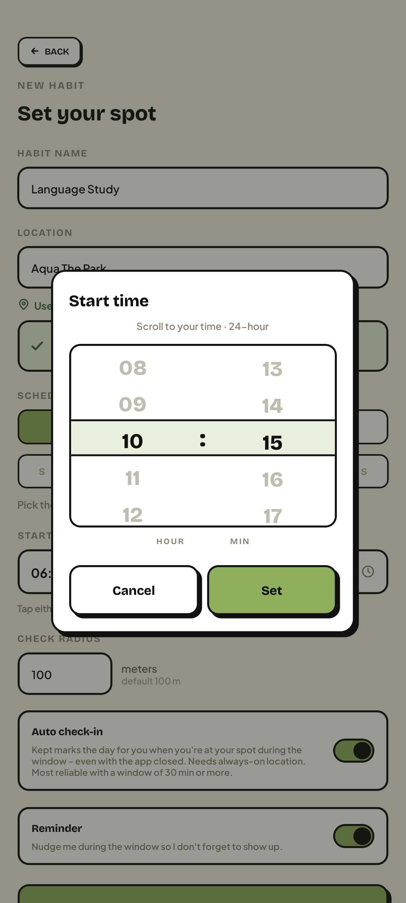
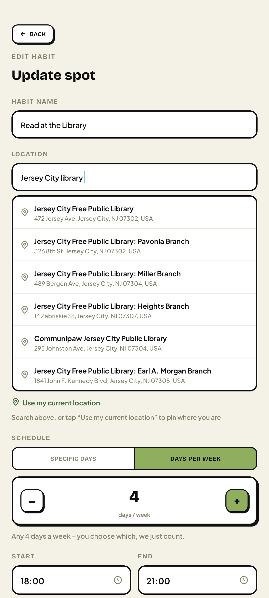
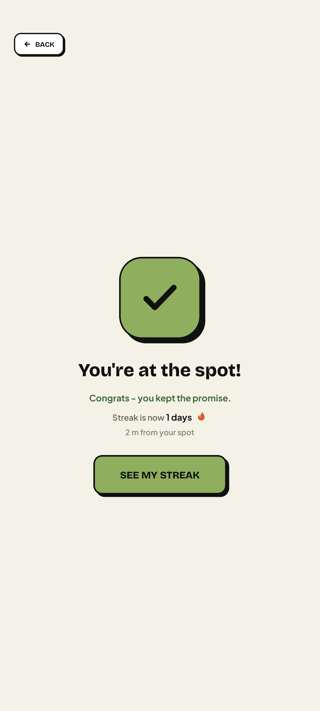
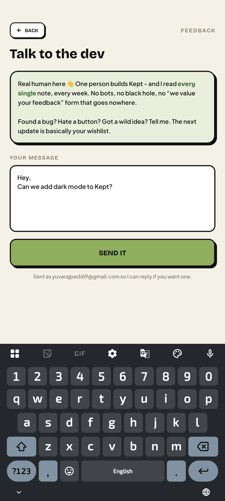

# Kept

A location-based habit tracker. Pick a place, show up, keep the streak - Kept
checks that you actually got there instead of trusting a tap on the couch.

Built with **Expo (React Native) · expo-router · TypeScript · Supabase**.

## Screenshots

| Home | Stats | Habit calendar |
|---|---|---|
|  |  |  |

| Set your spot | Map search | Check-in |
|---|---|---|
|  |  |  |

| Feedback |
|---|
|  |

## Features

- **Location check-in** - confirms you're within range of a habit's spot (GPS)
  before a day counts.
- **Auto check-in** - on by default; background geofencing marks a habit when you
  arrive at the spot, even with the app closed.
- **Map search** - find a spot by name (Google Places) or drop your current
  location.
- **Two schedules** - specific weekdays, or "any N days a week".
- **Honest streaks** - count only scheduled days, one grace day, Kept % that
  reflects missed days.
- **Stats** - weekly/monthly summaries + a GitHub-style yearly heatmap.
- **Reminders** - local notifications in each habit's window (skipped once kept).
- **Accounts & sync** - email sign-in is required; habits back up and sync across
  devices in real time (Supabase), with account deletion. Offline-first: the
  local store is the source of truth and syncs when you're back online.
- **In-app feedback** - a feedback screen writes straight to Supabase.

## Setup

```bash
npm install --legacy-peer-deps          # peer-deps flag is required (see .npmrc)
cp .env.example .env                     # fill in the values below
```

`.env`:

| Var | Purpose |
| --- | --- |
| `EXPO_PUBLIC_SUPABASE_URL` / `EXPO_PUBLIC_SUPABASE_ANON_KEY` | Cloud sync + auth (required - login is mandatory) |
| `EXPO_PUBLIC_GOOGLE_PLACES_KEY` | Map / place search |

Supabase schema: run `supabase/schema.sql` then each `migration-*.sql`
(including `migration-03-feedback.sql`) in the Supabase SQL editor, and deploy
the `delete-account` Edge Function.

## Run

```bash
npx expo start        # scan QR in Expo Go (SDK 54) or press a / i
npm run typecheck     # tsc --noEmit
```

Background geofencing + auto check-in need a real build (below), not Expo Go.

## Build & release

Local (no EAS quota - builds on your machine into `builds/`):

```bash
bash scripts/build-apk.sh    # builds/kept-preview-<timestamp>.apk
```

EAS (cloud):

```bash
eas build --profile preview    --platform android   # standalone APK to test/share
eas build --profile production --platform android   # .aab for Play
eas submit --profile production --platform android
```

`.env` isn't read by cloud builds - non-secret `EXPO_PUBLIC_*` values live in
`eas.json` per profile. See `store-prep/LAUNCH_CHECKLIST.md` for the full path.

## Assets & store prep

- **App icon / splash:** `assets/icon.png`, `adaptive-icon.png`, `splash-icon.png`
  (regenerate: `node scripts/gen-icons.mjs`)
- **Play feature graphic:** `assets/feature-graphic.png` (1024×500,
  `node scripts/gen-feature-graphic.mjs`)
- **Screenshots:** `images/` (above) - capture with Settings → Data → *Load
  sample data* for full-looking screens.
- **Store docs:** `store-prep/` - privacy policy, listing copy, Data Safety
  answers, Play Console fill-ins, launch checklist.

## Project structure

```
app/         expo-router screens: home, habit/[id] (dashboard), setup, checkin,
             stats, profile, account, auth, onboarding, feedback, settings
components/  Screen, ui (Txt/Neo/Button/Field/TimePickerModal/ConfirmModal), icons, Heatmap
lib/         analytics (streak/Kept%/heatmap), geofence, notifications, geo,
             geocode, supabase, auth, sync, syncEngine, mockData, types
store/       zustand store (AsyncStorage-persisted) + cloud session
theme/       tokens (colors, fonts, hard shadow)
scripts/     gen-icons, gen-feature-graphic, build-apk
supabase/    schema.sql, migrations, delete-account Edge Function
```

## Notes

- Pinned to **Expo SDK 54** (matches the installed Expo Go).
- Roadmap (v1.1): iOS build, offline sync queue, richer place search.
